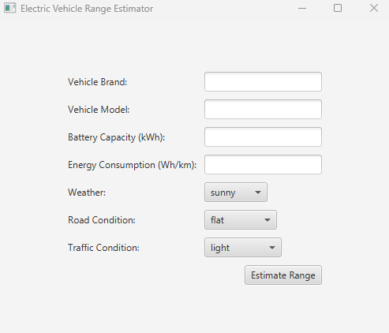
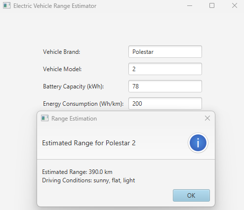

# E-Mobility-RangeEstimator
The Electric Vehicle Range Estimator project is an application that allows users to estimate the remaining range of an electric vehicle based on the driving conditions.
Electric Vehicle Range Estimator
The Electric Vehicle Range Estimator project is an application that allows users to estimate the remaining range of an electric vehicle based on the driving conditions. The application takes into account factors such as the battery's state of charge, energy consumption rate, and driving conditions (weather, road, and traffic conditions) to provide an estimation of the remaining range.

## Classes
The project consists of the following classes:

### 1. ElectricVehicle
The ElectricVehicle class represents an electric vehicle with the following attributes:

* make: String
* model: String
* batteryCapacity: double
* energyConsumption: double
* battery: Battery

Methods:
* getRangeEstimation(DrivingConditions conditions): RangeEstimation

### 2. Battery
The Battery class represents a battery with the following attributes:

* capacity: double
* stateOfCharge: double
* dischargeRate: double

Methods:
* getRemainingEnergy(): double
* estimateRange(double energyConsumption): double

### 3. DrivingConditions
The DrivingConditions class represents driving conditions with the following attributes:

* weather: String
* roadCondition: String
* trafficCondition: String

Methods:
* getEnergyConsumptionAdjustmentFactor(): double

### 4. RangeEstimation
The RangeEstimation class represents a range estimation with the following attributes:

* vehicle: ElectricVehicle
* conditions: DrivingConditions
* estimatedRange: double

Methods:
* displayEstimation(): void

### User Interface
The user interface is implemented using Java Swing and allows users to input vehicle information, battery capacity, and driving conditions. The application then calculates the estimated range based on the input values and displays the result on the screen.

### Unit Testing
The project includes unit tests for the Battery and DrivingConditions classes using JUnit 4. These tests ensure that the methods and calculations work as expected for various input values and scenarios.

### Usage
To run the application, simply compile and run the EVRangeEstimatorGUI class, which contains the main method. The application will display a graphical user interface where you can enter the vehicle information, battery capacity, and driving conditions. After entering the information, click on the "Calculate Range" button to receive the estimated range based on the input values.

### Dependencies
This project requires Java SE Development Kit 8 or higher and JUnit 4 for unit testing.
